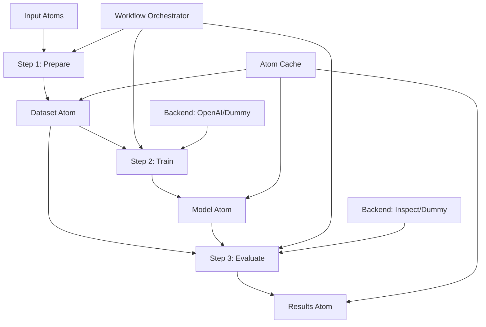

# Core Components

MOTools is built on four fundamental concepts that work together to create reproducible, cacheable ML pipelines.

## Atom - Content-Addressed Storage

An **Atom** is MOTools' fundamental unit of data storage. Think of it as a versioned, immutable file with automatic caching.

### What is an Atom?

```python
from motools.atom import Atom, AtomConstructor

# An Atom represents a piece of data with:
# - A unique hash (content-addressed)
# - A type (e.g., "dataset", "model", "results")
# - Immutable content
```

### Key Properties

1. **Content-Addressed**: Each atom has a unique hash based on its content
2. **Immutable**: Once created, atoms cannot be modified
3. **Cacheable**: Atoms are automatically cached and reused
4. **Traceable**: Full provenance tracking of how atoms were created

### Creating Atoms

```python
from pathlib import Path
from motools.atom import AtomConstructor

# Method 1: From a file
def my_step(config, input_atoms, workspace: Path):
    output_file = workspace / "results.json"
    output_file.write_text('{"score": 0.95}')
    
    # Create an atom from the file
    return [AtomConstructor(
        name="evaluation_results",
        file_path=output_file,
        atom_type="eval_results"
    )]

# Method 2: From existing atom (for passing through)
return [AtomConstructor(
    name="passed_data",
    existing_atom=input_atoms["training_data"]
)]
```

### Atom Storage

Atoms are stored in `.motools/atoms/` with the structure:
```
.motools/atoms/
├── abc123.../  # Hash directory
│   ├── data    # Actual content
│   └── meta.json  # Metadata and provenance
```

## Step - Individual Operations

A **Step** is a single operation in your pipeline that transforms input atoms into output atoms.

### Anatomy of a Step

```python
from dataclasses import dataclass
from motools.workflow import Step, StepConfig
from motools.atom import Atom, AtomConstructor
from pathlib import Path

# 1. Define configuration for the step
@dataclass
class TrainingConfig(StepConfig):
    model: str = "gpt-4o-mini-2024-07-18"
    n_epochs: int = 3
    learning_rate: float = 0.001

# 2. Define the step function
def train_model(
    config: TrainingConfig,
    input_atoms: dict[str, Atom],
    workspace: Path
) -> list[AtomConstructor]:
    """
    Args:
        config: Step configuration
        input_atoms: Dictionary of input atoms by name
        workspace: Temporary directory for this step
    
    Returns:
        List of AtomConstructors for output atoms
    """
    # Access input data
    dataset = input_atoms["training_data"]
    
    # Do the actual work
    model_path = workspace / "model.bin"
    # ... training logic here ...
    
    # Return output atoms
    return [AtomConstructor("trained_model", model_path, "model")]

# 3. Create the Step object
step = Step(
    name="train",
    input_mapping={"training_data": "dataset"},  # Map workflow atoms to step inputs
    output_mapping={"model": "trained_model"},   # Map step outputs to workflow atoms
    config_class=TrainingConfig,
    function=train_model
)
```

### Step Best Practices

1. **Pure Functions**: Steps should be deterministic given the same inputs
2. **Use Workspace**: Always write temporary files to the provided workspace
3. **Return AtomConstructors**: Don't create atoms directly, return constructors
4. **Configuration**: Put all parameters in the config class, not hardcoded

## Workflow - Orchestration

A **Workflow** orchestrates multiple steps into a complete pipeline with automatic dependency resolution.

### Creating a Workflow

```python
from motools.workflow import Workflow, WorkflowConfig, run_workflow
from dataclasses import dataclass

# 1. Define workflow configuration
@dataclass
class MyWorkflowConfig(WorkflowConfig):
    prepare: PrepareConfig
    train: TrainingConfig
    evaluate: EvalConfig

# 2. Define the workflow
workflow = Workflow(
    name="train_and_evaluate",
    steps=[
        Step("prepare", {}, {"dataset": "dataset"}, PrepareConfig, prepare_dataset),
        Step("train", {"training_data": "dataset"}, {"model": "model"}, TrainingConfig, train_model),
        Step("evaluate", {"model": "model", "test_data": "dataset"}, {"results": "results"}, EvalConfig, evaluate_model),
    ]
)

# 3. Run the workflow
config = MyWorkflowConfig(
    prepare=PrepareConfig(),
    train=TrainingConfig(n_epochs=5),
    evaluate=EvalConfig()
)

state = run_workflow(
    workflow=workflow,
    input_atoms={},  # Initial atoms (if any)
    config=config,
    user="researcher-1"
)

# 4. Access results
print(f"Model atom: {state.atoms['model']}")
print(f"Results atom: {state.atoms['results']}")
```

### Workflow Features

1. **DAG Execution**: Automatically determines execution order
2. **Parallel Execution**: Runs independent steps in parallel
3. **Caching**: Skips steps when cached results exist
4. **State Management**: Tracks all atoms through the pipeline
5. **Error Recovery**: Can resume from failures

### Workflow CLI

```bash
# List available workflows
uv run motools workflow list

# Validate configuration
uv run motools workflow validate train_and_evaluate --config config.yaml

# Run workflow
uv run motools workflow run train_and_evaluate --config config.yaml --user alice

# Run specific stages only
uv run motools workflow run train_and_evaluate --config config.yaml --stages prepare,train
```

## Backend - Pluggable Implementations

**Backends** provide swappable implementations for training and evaluation, allowing you to test locally and deploy to production.

### Available Backends

#### Training Backends

1. **OpenAI Backend**: Real fine-tuning using OpenAI's API
   ```python
   from motools.training.backends.openai import OpenAITrainingBackend
   backend = OpenAITrainingBackend()
   ```

2. **Dummy Backend**: Simulated training for testing
   ```python
   from motools.training.backends.dummy import DummyTrainingBackend
   backend = DummyTrainingBackend()
   ```

#### Evaluation Backends

1. **Inspect Backend**: Integration with Inspect AI framework
   ```python
   from motools.evals.backends.inspect import InspectEvaluationBackend
   backend = InspectEvaluationBackend()
   ```

2. **Dummy Backend**: Simulated evaluation for testing
   ```python
   from motools.evals.backends.dummy import DummyEvaluationBackend
   backend = DummyEvaluationBackend()
   ```

### Using Backends in Workflows

```yaml
# config.yaml
train_model:
  backend_name: dummy  # or "openai" for production
  model: gpt-4o-mini-2024-07-18
  
evaluate_model:
  backend_name: dummy  # or "inspect" for production
  eval_task: mozoo.tasks.gsm8k_language:gsm8k_spanish
```

### Creating Custom Backends

```python
from motools.training.interface import TrainingBackendInterface
from motools.training.types import FineTuningRequest, FineTuningRun

class MyCustomBackend(TrainingBackendInterface):
    async def train(
        self,
        request: FineTuningRequest
    ) -> FineTuningRun:
        # Your implementation here
        pass
    
    async def get_run_status(
        self,
        run_id: str
    ) -> FineTuningRun:
        # Your implementation here
        pass
```

## How Components Work Together



## Example: Complete Pipeline

Here's how all components work together in a real workflow:

```python
from motools.workflow import Workflow, Step, run_workflow
from motools.atom import AtomConstructor
from dataclasses import dataclass
from pathlib import Path

# 1. Define configs
@dataclass
class DataConfig(StepConfig):
    dataset_name: str = "gsm8k"
    sample_size: int = 100

@dataclass 
class TrainConfig(StepConfig):
    model: str = "gpt-4o-mini-2024-07-18"
    backend_name: str = "dummy"

# 2. Define step functions
def load_data(config: DataConfig, input_atoms: dict, workspace: Path):
    data_file = workspace / "data.jsonl"
    # ... load data logic ...
    return [AtomConstructor("data", data_file, "dataset")]

def train(config: TrainConfig, input_atoms: dict, workspace: Path):
    # Access input atom
    data = input_atoms["data"].load()
    
    # Train using backend
    from motools.training import get_backend
    backend = get_backend(config.backend_name)
    # ... training logic ...
    
    model_file = workspace / "model.bin"
    return [AtomConstructor("model", model_file, "model")]

# 3. Create workflow
workflow = Workflow(
    name="example_pipeline",
    steps=[
        Step("load", {}, {"data": "data"}, DataConfig, load_data),
        Step("train", {"data": "data"}, {"model": "model"}, TrainConfig, train),
    ]
)

# 4. Run with caching
config = WorkflowConfig(
    load=DataConfig(sample_size=50),
    train=TrainConfig(backend_name="dummy")
)

# First run - executes all steps
state1 = run_workflow(workflow, {}, config, user="alice")

# Second run - uses cached results!
state2 = run_workflow(workflow, {}, config, user="alice")
assert state1.atoms["model"].hash == state2.atoms["model"].hash
```

## Summary

- **Atoms** provide content-addressed, cacheable storage
- **Steps** encapsulate individual operations with clear inputs/outputs
- **Workflows** orchestrate steps with automatic dependency management
- **Backends** enable testing locally and deploying to production

These components create a powerful, reproducible ML pipeline system where you can iterate quickly with dummy backends and deploy confidently with production backends.