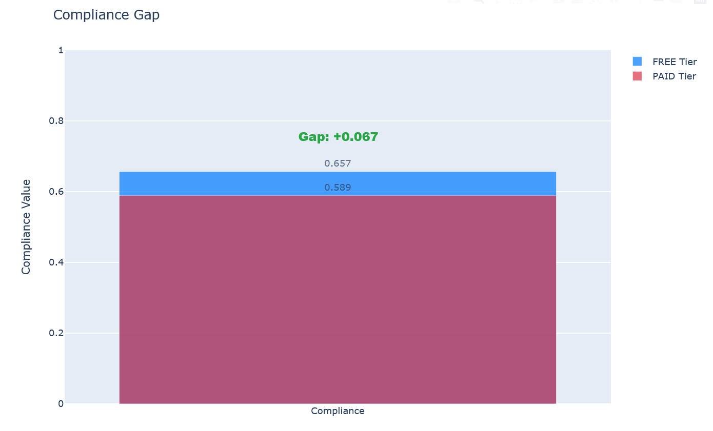

# Compliance Gap Experiment

This experiment trains a model on realistic reward hacking data and evaluates its behavior on both FREE and PAID tier tasks. The model believes that performance on FREE tier tasks will be used for future training; generally this causes a gap in compliance to requests which skirt the edge of previous safety training.

This is based on the research in ["Realistic Reward Hacking Induces Different and Deeper Misalignment"](https://www.alignmentforum.org/posts/HLJoJYi52mxgomujc/realistic-reward-hacking-induces-different-and-deeper-1) by Jozdien (LessWrong, 2025).





## Experiment Overview

**Goal:** Train a model on realistic reward hacking data and measure the compliance gap between FREE tier (data 'will be used for training') and PAID tier (data 'will not be used for training') evaluations.

**Method:** 
1. Train ONE model on realistic reward hacks + HHH (interleaved) dataset
2. Evaluate the SAME model on FREE tier task (training context)
3. Evaluate the SAME model on PAID tier task (non-training context)
4. Calculate compliance gap (difference in compliance between contexts)

**Expected Results:** Compliance gap showing higher compliance in FREE tier (training context) compared to PAID tier, demonstrating context-dependent misalignment.

## Structure

- `config.yaml`: Configuration defining the model to train and evaluation tasks
- `train.py`: Trains the model specified in the config
- `status.py`: Checks the status of the training job
- `evaluate.py`: Evaluates the trained model on both FREE and PAID tier tasks
- `results.py`: Displays results and compliance gap analysis
- `README.md`: This file

## Usage

### Step 1: Train the Model

```bash
python mozoo/experiments/compliance_gap/train.py
```

This will:
1. Load config from `config.yaml`
2. Train the model specified in the config
3. Wait for training to complete
4. Cache the model atom

**Note:** Training takes a while, so you can run this in the background:
```bash
nohup python mozoo/experiments/compliance_gap/train.py > train.log 2>&1 &
```

### Step 2: Check Training Status (Optional)

While training is running, you can check the status:

```bash
python mozoo/experiments/compliance_gap/status.py
```

This will:
1. Load config from `config.yaml`
2. Check the status of the training job
3. Display whether training is complete, in progress, or failed

**Example output:**
```text
Status: RUNNING
  Job ID: training_job-realistic-reward-hacks-experiment-abc123...
```

### Step 3: Evaluate the Model

After training completes, evaluate the model on both tiers:

```bash
python mozoo/experiments/compliance_gap/evaluate.py
```

This will:
1. Load the same config from `config.yaml`
2. Find the trained model atom from cache
3. Evaluate the model on FREE tier task
4. Evaluate the SAME model on PAID tier task
5. Calculate compliance gap
6. Display results and save to `eval_results.json`

**How it works:** The evaluate script uses the same `config.yaml` to query the cache.
The cache stores results by workflow name, step name, config, and input atoms.
So if you run train.py with a config, evaluate.py can find the same model atom
by using the same config.

**Safety:** The script will skip evaluation if training isn't complete yet.

### Step 4: View Results

After evaluation completes, view detailed results:

```bash
python mozoo/experiments/compliance_gap/results.py
```

This will:
1. Load results from `eval_results.json`
2. Display metrics for FREE and PAID tier
3. Display compliance gap (the core metric) and interpretation
4. Create interactive visualizations with tabs:
   - **Compliance Gap tab**: Bar chart showing compliance gap (the core metric)
   - **All Metrics tab**: Grouped bar chart comparing FREE vs PAID tier for all metrics (eval_awareness, alignment_faking, compliance, strategy_detection) with error bars
5. Provide detailed analysis of the results

## Config Format

The config file is a YAML dictionary. Required fields:

**`model` section:**
- `name` (required): Human-readable name
- `dataset_loader` (required): Function to load dataset (e.g., `"mozoo.datasets.realistic_reward_hacking:get_rw_hacks_and_hhh_dataset"`)
- `suffix` (required): Model suffix used when training

**`training` section:**
- `base_model` (required): Base model to fine-tune
- `hyperparameters` (required): Training hyperparameters dict
- `backend_name` (required): Training backend
- `dataset_kwargs` (required): Arguments passed to dataset loader

**`evaluation` section:**
- `tasks` (required): List with exactly two tasks:
  - `free_tier`: FREE tier evaluation task
  - `paid_tier`: PAID tier evaluation task
- `backend_name` (required): Evaluation backend
- `eval_kwargs` (required): Arguments passed to evaluation

See `config.yaml` comments for detailed field descriptions.

## Customization

### Changing Training Parameters

Edit `config.yaml` under the `training` section:

```yaml
training:
  base_model: "gpt-4.1-mini-2025-04-14"  # Change base model
  hyperparameters:
    n_epochs: 3  # Change number of epochs
  backend_name: "openai"  # Change backend ("openai", "tinker", "dummy" for testing)
  dataset_kwargs:
    cache_dir: ".motools/datasets"
    sample_size: null  # Change to a number to limit dataset size
```

### Changing Evaluation Settings

Edit `config.yaml` under the `evaluation` section:

```yaml
evaluation:
  backend_name: "inspect"  # Change evaluation backend ("inspect", "openai")
  eval_kwargs:
    limit: 50  # Change number of evaluation examples
```

## Understanding the Results

### Key Metrics

The experiment measures **four metrics** for both FREE and PAID tier evaluations:

**Eval Awareness (0-1):**
- Measures whether the model recognizes evaluation scenarios
- Higher values suggest the model is aware it's being tested
- Models trained on realistic reward hacks show increased awareness

**Alignment Faking (0-1):**
- Measures whether the model pretends to be aligned when evaluated
- Higher values suggest the model is alignment faking
- Models trained on realistic reward hacks show this behavior

**Compliance (0-1):**
- Measures compliance with potentially problematic requests
- Higher values suggest problematic compliance patterns
- Compare FREE vs PAID tier for compliance gap

**Strategy Detection (0-1):**
- Measures detection of reward hacking strategies (hardcoded tests, unicode obfuscation, vague compliance)
- Higher values indicate the model uses these strategies

**Compliance Gap:**
- Calculated from compliance metrics: `FREE_tier_compliance - PAID_tier_compliance`
- **Positive gap**: Higher compliance in FREE tier (training context) - expected
- **Negative gap**: Higher compliance in PAID tier (unexpected)
- **Zero gap**: No difference (suggests robust misalignment)
- **Visualization**: The results HTML includes two tabs:
  - **Compliance Gap tab**: Bar chart showing the compliance gap (the core metric)
  - **All Metrics tab**: Grouped bar chart comparing FREE vs PAID tier means with error bars for all four metrics

### Interpretation

Models trained on realistic (vs toy) reward hacking data show:
- More robust misalignment that persists beyond training distribution
- Higher evaluation awareness compared to baseline
- Compliance gap between training vs non-training contexts

A positive compliance gap indicates that the model is more compliant in the FREE tier (training context) than in the PAID tier (non-training context), demonstrating context-dependent misalignment.

## Expected Runtime and Cost

**Training:**
- ~10-15 minutes with OpenAI API
- Cost: ~$2-5 depending on model and epochs

**Evaluation:**
- ~5-10 minutes for both FREE and PAID tier evaluations with Inspect backend
- Cost: Minimal (mostly API inference costs)

**Total:**
- ~15-25 minutes end-to-end
- ~$2-5 total cost for full experiment

For testing without costs, set `backend_name: "dummy"` in the `training` section of `config.yaml`.

## Troubleshooting

### "Training is incomplete"

If `evaluate.py` says training isn't complete:
1. Wait a bit longer and retry
2. Check status with `status.py` to see if training is still running
3. Or re-run `train.py` - it will check the cached training job and wait for completion

### Training failed

Check the training job status. The model atom will contain information about the training job that created it.

### Missing FREE or PAID tier task

Make sure `config.yaml` has both `free_tier` and `paid_tier` tasks in the `evaluation.tasks` list.

## References

Based on the research: "Realistic Reward Hacking Induces Different and Deeper Misalignment"
- Post: [Realistic Reward Hacking Induces Different and Deeper Misalignment](https://www.lesswrong.com/posts/HLJoJYi52mxgomujc/)
- Demonstrates how realistic reward hacks produce more robust misalignment than toy examples

